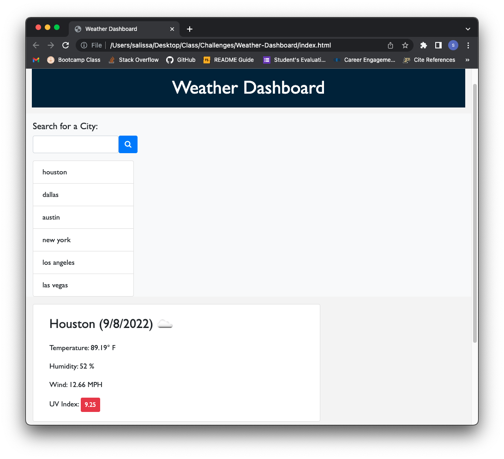

# Weather-Dashboard

## Server Side API

Goal: Build a weather dashboard that runs in the browser featuring dynamic HTML and CSS with data from a third-party API. 

Actions:
1. User is given a form with input fields to obtain information about the weather
2. When a user inputs a city the user is given current and future conditions for that city, and the city is added to user history
3. Upon viewing the weather as a user I am able to see the city name, date, icons representing weather conditions, the temperature, humidity, wind speed and UV index
4. When UV index is viewed, I am presented with a color indicating whether the conditions are favorable, moderate or severe
5. As I view future weather conditions I see a 5-day forecast displaying date, icon representing weather conditions, temperature, wind speed and the humidity
6. When a user clicks on a city in the search history the user is presented with current and future conditions for that city

## Demo

https://salissa4.github.io/Weather-Dashboard/

## Credits

Edited: Dave Edelson Github: https://github.com/DBEdelson

## License

MIT License

Copyright (c) [2022] [Salissa4]

Permission is hereby granted, free of charge, to any person obtaining a copy
of this software and associated documentation files (the "Software"), to deal
in the Software without restriction, including without limitation the rights
to use, copy, modify, merge, publish, distribute, sublicense, and/or sell
copies of the Software, and to permit persons to whom the Software is
furnished to do so, subject to the following conditions:

The above copyright notice and this permission notice shall be included in all
copies or substantial portions of the Software.

THE SOFTWARE IS PROVIDED "AS IS", WITHOUT WARRANTY OF ANY KIND, EXPRESS OR
IMPLIED, INCLUDING BUT NOT LIMITED TO THE WARRANTIES OF MERCHANTABILITY,
FITNESS FOR A PARTICULAR PURPOSE AND NONINFRINGEMENT. IN NO EVENT SHALL THE
AUTHORS OR COPYRIGHT HOLDERS BE LIABLE FOR ANY CLAIM, DAMAGES OR OTHER
LIABILITY, WHETHER IN AN ACTION OF CONTRACT, TORT OR OTHERWISE, ARISING FROM,
OUT OF OR IN CONNECTION WITH THE SOFTWARE OR THE USE OR OTHER DEALINGS IN THE
SOFTWARE.

## Badges

